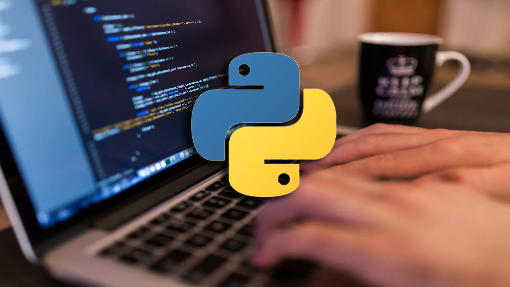

# Programming and Data Analysis for Modern Neuroscience
NEU 365P/385L - Spring 2023



# Table of Contents
- [Course Objective](#course-objective)
    - [Breadth over Depth](#breadth-over-depth)
    - [Concept before Math](#concept-before-math)
- [Course Policies](#course-policies)
    - [Prerequisites](#prerequisites)
    - [Requirements](#requirements)
    - [Inclusion](#inclusion)
    - [Academic Integrity](#academic-integrity)
    - [Accomodations](#accomodations)
    - [Contact](#contact)
    - [Office Hours](#office-hours)
    - [Attendance](#attendance)
    - [Grading](#grading)
    - [Grading Rubric](#grading-rubric)
- [Discussion Board](#discussion-board)
- [Programming Rules of Thumb](#programming-rules-of-thumb)
- [Syllabus](#syllabus) 📆
- [Setup your Python environment](#setup-your-python-environment)
- [Keep up-to-date with the course GitHub repository](#keep-up-to-date-with-the-course-github-repository)
- [Resources](#resources)

# Course Objective
*The ability to read and write are obvious fundamental skills critical to all academic and quantitative pursuits.* **Fast approaching this level of fundamental importance is the ability to write computer programs to analyze and manipulate data sets ever increasing in richness and size.** This skillset is necessary to work with a wide array of systems whose models and behavior are sufficiently complex to make analysis by hand intractable.

**In this course you will translate problems into code applying modern approaches for data analysis, statistical inference and modeling to various levels of neural systems and their component behavior.** We will use Python as a coding environment, and you will be exposed to resources and options for scientific computing.

 *Although geared for neuroscience, the approaches covered in this course are highly salient for a wide array of applications.*

## Breadth over Depth
We will cover a wide array of topics rather than explore any one topic in great detail (see [Syllabus](#syllabus)). Topics will be introduced at a level where you should be able to understand each concept and put them to use. However, realize up front that we may have only scratched the surface.

*The goal of the course is to give you enough of a basic toolset that you will have the necessary foundation to develop programs for any concept that you understand.*

## Concept before Math
It is my opinion that in many cases it is advantageous to first gain a conceptual understanding for an analytical method prior to attempting to fully understand all of the underlying math. In this course we will leverage computational resources that enable you to quickly apply and gain a working understanding of many data analysis techniques without having to fully understand their complete mathematical basis.

This is not to say that the math is unimportant, but rather that your goal in this course will be both a conceptual understanding and practical working ability to utilize the approaches discussed. I leave it to you to gain a more complete mathematical understanding of those approaches you are interested in using outside of this course (*which you should do*). To that end, the working and conceptual understanding you gain here should make this a much easier task.

Finally, it is impossible to avoid math entirely when discussing data analysis techniques. I will endevour to keep the math as basic as possible and focus on the concepts.

# Course Policies
## Prerequisites
There are no prerequisites for this course. *However, you are expected to be familiar with basic mathematical functions and concepts, and you will be asked to perform quantitative calculations and to think critically.* **This is NOT an easy course.**

## Requirements
- You must **bring a laptop to class** for hands on participation. If you do not own a laptop, contact your department or the College of Natural Sciences to obtain a loaner for the duration of the course.
- You should:
    - be motivated
    - **be prepared to work hard**
    - be respectful
    - **help to foster an inclusive environment**
    - have fun!

## Inclusion
Along with the entire Department of Neuroscience, this course embraces a notion of an intellectual community enriched and enhanced by diversity along a number of dimensions, including race, ethnicity and national origins, gender and gender identity, sexuality, class, ability level, and religion. We are especially committed to fostering an environment where you feel heard and respected in your courses.

## Academic Integrity
It is perfectly fine to work with your fellow students or anyone else on the homework assignments. If you do so, **you must include a note on your assignment indicating with whom you collaborated**. Any academic dishonesty such as copying a fellow students assignment without collaborating in its completion will be severly punished as outlined by the University. **Most importantly, the ability to solve problems such as those in the homeworks is exactly the skillset you are here to obtain.**

## Accomodations
Students with disabilities may request appropriate academic accommodations from the Division of Diversity and Community Engagement, [Services for Students with Disabilities](http://www.utexas.edu/diversity/ddce/ssd/) (471-6259). 

## Contact
Please contact myself or the TA via **Canvas**.

## Office Hours
Office hours will be both in person and over Zoom, so you can attend as you see fit. The Zoom link for office hours will be posted on **Canvas**.

## Attendance
You are expected to attend all classes. **In-class quizzes cannot be made up.** If you have to miss a class, you must inform me as far ahead of time as is possible.

## Grading
Your grade is determined by your cumulative points total from **attendance**, **homework**, and in-class **quizes**.
```
A: 90-100%
B: 80-89%
C: 70-79%
D: 60-69%
F: <60%
```
Depending on the distribution of scores, I may alter the above ranges to normalize to the difficulty of the assignments. If I do so, **any alteration will only be favorable to you and never unfavorable**. Note that in the case that I do change the ranges, *I will NOT apply a curve to the letter grades*. **I am very happy to give everyone an A if possible.**

## Grading Rubric
Most questions will be worth 3 pts for which the grading rubric is:
```
+1 pt for a remotely valid attempt
+2 pts if there are only minor mistakes
+3 pts if appropriately addressed
```

# Discussion Board
See **Canvas** for a link to the discussion board.

RULES:
- Your identifier MUST BE YOUR NAME if you want to receive extra credit for your participation (see below).
- Be *respectful and inclusive*.
- Do NOT be afraid to *ask questions*.
- You may post code snippets that help to illustrate or answer a question, but do NOT post complete answers to the homework.

You will receive **EXTRA CREDIT for participating** in the course discussion board. Each post that we deem appropriate (I realize this is subjective) will be worth 1 pt of extra credit up to a max of 3 pts per week. For example, *asking or answering a question* are both worth 1 pt each. You can also receive 1 pt for posting a *link to a relevant resource*, but you need to describe the relevance in your post.

# Programming Rules of Thumb
*Being good at programming is NOT simply knowing a lot of program syntax.*

It is about:

- Understanding a problem conceptually and being able to translate it into code.
- Thinking of new ways to tackle a problem and knowing what tools to use.
- Knowing how to fix your program when it does not work.
- Writing a program that is fast enough, not the fastest possible.
- Writing a program that can be understood by other people (or by yourself in a year!)

# Syllabus
⚠️ *The syllabus is subject to change as the course progresses depending on my judgement.* This is because I modify my course every year to make it that much better for you. That said, the current syllabus is at least a reasonable approximation of what the final course will look like.

- Jan 10 T - **[Python ecosystem](/python-ecosystem.pptx) & [Python basics 1](/python-basics-1)**
    - ✏️ [python-basics-hw.ipynb](/assignments/python-basics-hw.ipynb), 📎 [What can I do with Python?](https://realpython.com/what-can-i-do-with-python/), 📎 [Intro to Jupyter and JupyterLab](https://coderefinery.github.io/jupyter/), 📎 [Intro to Python](http://nbviewer.ipython.org/urls/raw.github.com/jrjohansson/scientific-python-lectures/master/Lecture-1-Introduction-to-Python-Programming.ipynb), 📎 [Python beginner tutorials](https://www.tutorialsteacher.com/python), 📎 [Python basics](https://www.learnpython.org), 📎 [The Hitchhiker's Guide to Python](https://docs.python-guide.org/intro/learning/), 📎 [More Python tutorials](https://wiki.python.org/moin/BeginnersGuide/NonProgrammers), 📎 [Python Tutor](https://pythontutor.com), 📎 [Python for Neuroscience](https://pyforneuro.com/)
- Jan 12 R - **[Python basics 2: Lists, mutations & functions](/python-basics-2)**
    - ✏️ [lists-functions-hw.ipynb](/assignments/lists-functions-hw.ipynb), 📎 [Python lists](https://developers.google.com/edu/python/lists), 📎 [List exercises](https://holypython.com/beginner-python-exercises/exercise-6-python-lists/), 📎 [List slicing exercises](https://holypython.com/beginner-python-exercises/exercise-17-python-slicing/)
- Jan 17 T - **[Multi-dimensional data arrays](/numpy-ndarrays)**
    - ✏️ [numpy-hw.ipynb](/assignments/numpy-hw.ipynb), 📎 [A visual intro to NumPy](https://jalammar.github.io/visual-numpy/)
- Jan 19 R - **[Data visualization](/matplotlib-data-visualization) & [Random walk lab](/random-walk-lab)**
    - ✏️ [random-walk-hw.ipynb](/assignments/random-walk-hw.ipynb)
- Jan 24 T - **[Probability distributions of random variables](/probability-distributions)**
    - ✏️ [probability-distributions-hw.ipynb](/assignments/probability-distributions-hw.ipynb), 🎬 [Probability distributions video series](https://www.youtube.com/playlist?list=PLTNMv857s9WVzutwxaMb0YZKW7hoveGLS), 🎬 [Probability density and normal distribution](https://www.youtube.com/watch?v=CVjr-Dox3Ck), 🎬 [Standard error](https://www.youtube.com/watch?v=A82brFpdr9g&list=PLblh5JKOoLUIcdlgu78MnlATeyx4cEVeR&index=36)
- Jan 26 R - **[Optimization & Maximum Likelihood Estimation (MLE)](/maximum-likelihood-estimation)**
    - ✏️ [mle-hw.ipynb](/assignments/mle-hw.ipynb), 🎬 [Probability vs. likelihood](https://www.youtube.com/watch?v=pYxNSUDSFH4), 🎬 [Maximum likelihood estimation](https://www.youtube.com/watch?v=XepXtl9YKwc)
- Jan 31 T - CANCELLED DUE TO WINTER STORM
- Feb 02 R - CANCELLED DUE TO WINTER STORM
- Feb 07 T - **[Hypothesis testing and p-values](/hypothesis-testing-p-values.pptx)**
    - 🎬 [p-value](https://www.youtube.com/watch?v=4XfTpkGe1Kc), 📰 [Rigor in plots](https://www.nature.com/articles/548153a)
- Feb 09 R - **[Resampling: Bootstrap & permutation](/resampling)**
    - ✏️ [resampling-hw.ipynb](/assignments/resampling-hw.ipynb), 📎 [Permutation test alpaca example](https://www.jwilber.me/permutationtest/)
- Feb 14 T - **[Sequence data, sampling artifacts & Convolution](/sequences-convolution)**
    - ✏️ [time-series-hw.ipynb](/assignments/time-series-hw.ipynb)
- Feb 16 R - **[Leaky Integrate & Fire (LIF) neuron](/LIF-neuron-model)**
    - ✏️ [neuron-simulation-hw.ipynb](/assignments/neuron-simulation-hw.ipynb)
- Feb 21 T - **[Data tables](/pandas-dataframe)**
- Feb 23 R - **[LIF neuron](/LIF-neuron-model) and [Hidden Markov Models (HMMs)](/hidden-markov-model)**
- Feb 28 T - **[Hidden Markov Models (HMMs)](/hidden-markov-model)**
- Mar 02 R - **[Linear regression](/linear-regression)**
    - ✏️ [linear-regression-hw.ipynb](/assignments/linear-regression-hw.ipynb)
- Mar 07 T - **[Nonlinear regression (Polynomial & K-Nearest Neighbors)](/nonlinear-regression)**
    - ✏️ [](/assignments/nonlinear-regression-hw.ipynb)
- Mar 09 R - **[Bias/Variance tradeoff,Train/Test split & Cross validation](/cross-validation)**
    - ✏️ [cross-validation-hw.ipynb](/assignments/cross-validation-hw.ipynb)
- Mar 14 T - SPRING BREAK
- Mar 16 R - SPRING BREAK
- Mar 21 T - **[Generalized Linear Model (GLM): Poisson & Logistic regression](/generalized-linear-model)**
    - ✏️ [glm-hw.ipynb](/assignments/glm-hw.ipynb)
- Mar 23 R - **[Regularization](/regularization)**
    - ✏️ [regularization-hw.ipynb](/assignments/regularization-hw.ipynb)
- Mar 28 T - **[Classification, confusion matrix, ROC curve](/classification)**
- Mar 30 R - **[Support Vector Machine (SVM), Random forest (bagging) & XGBoost (boosting) classifies](/svm-bagging-boosting)**
    - ✏️ [classification-hw.ipynb](/assignments/classification-hw.ipynb)
- Apr 04 T - **[Python basics 3: Classes & Modules](/python-basics-3)**
    - 🎬 [An opinion on classes and object-oriented programming (OOP)](https://www.youtube.com/watch?v=QM1iUe6IofM&t=2618s)
- Apr 06 R - **[Clustering](/clustering)**
    - ✏️ [clustering-hw.ipynb](/assignments/clustering-hw.ipynb)
- Apr 11 T - **[Principal Component Analysis (PCA)](/principal-component-analysis)**
- Apr 13 R - **[PCA for EEG waveforms](/EEG-PCA) & [RNAseq lab](/RNAseq-lab)**
    - ✏️ [pca-hw.ipynb](/assignments/pca-hw.ipynb), 📰 [Recent article relevant to dimensionality reduction](https://doi.org/10.1038/s43588-022-00380-4)
- Apr 18 T - **[Neural Networks (NNs)](/neural-network)**
    - ✏️ [](/assignments/neural-net-hw.ipynb), 🎬 [Excellent Neural Networks video series](https://www.youtube.com/playlist?list=PLZHQObOWTQDNU6R1_67000Dx_ZCJB-3pi)
- Apr 20 R - **[Convolutional Neural Network (CNN)](/neural-network)**

Additional topics I wish we had the time to cover:
- Recurrent Neural Networks (RNNs)
- Bayesian probability

# Setup your Python environment
## 1. Install Conda
Download and install the latest version of [Miniconda3](https://docs.conda.io/en/latest/miniconda.html).

*On macOS I suggest using the **pkg** installer as it is the simplest.*

## 2. Configure Conda
Conda groups collections of packages into [channels](https://docs.conda.io/projects/conda/en/latest/user-guide/concepts/channels.html). Most of the packages that you will install for this course will come from either the defaults or [conda-forge](https://conda-forge.org/docs/user/introduction.html) channels. Conda only searches channels that you tell it to. To setup conda so that it automatically searches the [conda-forge](https://conda-forge.org/docs/user/introduction.html) channel before searching the defaults channel, open a cmd shell or terminal and run:
```
conda config --add channels conda-forge
```
To see a list of all of the channels that conda will search (top = highest priority, bottom = lowest priority):
```
conda config --show channels
```
Note that this configuration is optional. You can always specify the channel to search when installing packages on a per package basis. An example of this is shown in the next step.

## 3. Create a sandboxed Python environment for this course
First, create a new conda environemnt named "neu365p". In a cmd shell or terminal run:
```
conda create -n neu365p
```
Next, set "neu365p" as the active environment for all conda commands. Run:
```
conda activate neu365p
```
Now install the latest version of the `python` package (from the defaults channel) into the active ("neu365p") environment.
```
conda install python
```
Finally, install the latest version of the `jupyterlab` package (from the conda-forge channel) into the active ("neu365p") environment.
```
conda install jupyterlab -c conda-forge
```

*Note that if you configured conda to automatically search the conda-forge channel, then you could omit the `-c conda-forge` portion of the last command.*

⚠️ Note that each time you open a new cmd shell or terminal, you will need to activate the conda environment that you want to use:
```
conda activate neu365p
```
The currently active environment should be displayed in your command prompt, e.g. `(neu365p)`.

You can see a list of all your conda environments with:
```
conda env list
```
You can see a list of all installed packages in your active environment with:
```
conda list
```

## 4. Open JupyterLab
JupyterLab is a complete Python coding user interface that supports Jupyter notebooks (which we will use in this course). It runs in a tab in your browser.

Open a cmd shell or terminal and make sure your "neu365p" environment is active:
```
conda activate neu365p
```
Next, in a cmd shell or terminal where "neu365p" is active run:
```
jupyter-lab
```
This will start **JupyterLab which will open up a tab in your browser with a complete user interface** for writing and running Python code.

When you are done using JupyterLab, from within the JupyterLab browser interface select `File->Shutdown`.

## 5. `OPTIONAL:` Install Visual Studio Code (VSCode)
There are a variety of user interfaces for Python coding from the most basic text editor and cmd shell to more complex user interfaces with more features such as JupyterLab. One alternative to JupyterLab that is compatible with Jupyter notebooks is VSCode.
1. Download [Visual Studio Code (VSCode)](https://code.visualstudio.com/)
2. Open VSCode and install the **Python** and **Jupyter** extensions.
3. In VSCode, Select `View->Command Palette...` and search for and select `Python: Select Interpreter`, then select the Python version associated with your neu365p environment (e.g., `Python 3.11.0 ('neu365p')`).
4. In VSCode you can also set the Python interpreter for each individual file. When you open a Python file the interpreter will be displayed in one of the corners. Make sure it is set to the Python version associated with neu365p, otherwise click the displayed interpreter and select from the dropdown the one for neu365p.

*It does NOT matter which user interface you use.* Both JupyterLab and VSCode will give you a pretty similar experience.

# Keep up-to-date with the course GitHub repository
1. Create a [GitHub](https://github.com) account for yourself (it's free). 
2. Download the [GitHub Desktop](https://desktop.github.com) application.
3. Sign into to GitHub Desktop using your GitHub account credentials.
4. Go to [the course GitHub repo](https://github.com/marcel-goldschen-ohm/NEU-365P-385L-Spring-2023), click the `<> Code` button in the upper right and choose `Open with GitHub Desktop`. This will open GitHub Desktop on your computer and ask you to choose a location in which to clone (copy) all of the course repo files. When it is done you will have a local copy of the course GitHub repo in a folder on your computer.
5. Whenever you want to make sure your local copy is an up-to-date reflection of the current online course repo, all you have to do is launch GitHub Desktop, select the repo for this course and click the `Fetch Origin` button in the upper right. If this button changes to `Pull Origin`, that means that there are changes in the online repo that you do not have locally. Just click the `Pull Origin` button and all of the changes including new files in the online repo will be downloaded so that your local repo is an exact copy of the current online course repo.
6. ⚠️ Whenever you execute Step #5 above, your local repo will become an EXACT COPY of the online course repo. *THIS INCLUDES RESETTING ANY HOMEWORK FILES YOU COMPLETED WITH THE ONLINE BLANK HOMEWORK FILES!* To avoid this, make sure **YOU MOVE YOUR HOMEWORK FILES OUTSIDE OF YOUR LOCAL REPO FOLDER BEFORE YOU WORK ON THEM!**

# Resources
- [Python Beginner Basics](https://www.tutorialsteacher.com/python): This looks like a good resource for Python basics.
- [Python Challenges](http://www.pythonchallenge.com): Fun way to test your Python skills.
- [Python Data Science Handbook](https://jakevdp.github.io/PythonDataScienceHandbook): This is a good resource for many of the topics covered in this course.
- [Statistics Done Wrong](https://www.statisticsdonewrong.com): You should read this.
- [Neuromatch Academy](https://compneuro.neuromatch.io/tutorials/intro.html): Online course in computational neuroscience with acompanying videos and Python tutorials.
- [Computational Neuroscience](https://mrgreene09.github.io/computational-neuroscience-textbook/index.html): Reletively short book providing an introduction along with Python examples for a variety of topics related to this course.
- [Modern Machine Learning Algorithms: Strengths and Weaknesses](https://elitedatascience.com/machine-learning-algorithms) Breif overview of strengths and weaknesses of many of the machine learning algorithms covered in this course.
- [An Introduction to Statistical Learning](https://www-bcf.usc.edu/~gareth/ISL/ISLR%20First%20Printing.pdf): Very good intro to fairly complex statistical methods with very little math. Example code is in R, but explanations are helpful in general. Note that this is a bit longer and more indepth, and is more about understanding statistical methods than coding.
- [Deep Learning Online Book](https://www.deeplearningbook.org/): Requires some comfort with mathematics.
- [List of neuroscience databases](https://en.wikipedia.org/wiki/List_of_neuroscience_databases)
- [Neuronal Dynamics online book](https://neuronaldynamics.epfl.ch/online/index.html) - Neuron models!

If you know of other great resources, please let me know and/or share them on the course discussion board!
